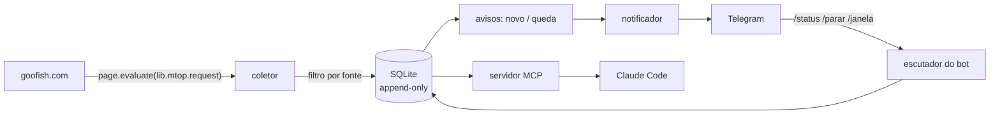

# goofish-miner

Acompanha lojas e buscas do **Goofish/Xianyu**, o marketplace de usados da
Alibaba, e avisa no Telegram quando aparece anúncio novo ou quando um preço
cai. Todo o histórico fica num SQLite local, e um servidor MCP deixa
consultá-lo em linguagem natural pelo Claude Code.

> **English summary.** A personal monitor for Goofish (Alibaba's second-hand
> marketplace). It calls the site's internal MTOP gateway *from inside the
> page* through Playwright instead of reverse engineering the request
> signature. It keeps an append-only SQLite price history, filters each
> store or search by price range and title terms, and sends Telegram alerts
> for new listings and price drops. An MCP server exposes read-only domain
> tools over the same database. Python 3.12, no ORM, no web framework,
> offline test suite.

## Por quê

O Goofish não tem alerta de preço nem API pública, e as melhores ofertas
somem em horas. Acompanhar à mão significa abrir as mesmas lojas e as mesmas
buscas em chinês várias vezes por dia, lembrando de cabeça quanto cada coisa
custava ontem.

## Como funciona



1. **Coleta.** Uma página do goofish.com aberta no Chrome via Playwright
   dispara as chamadas pelo SDK que o próprio site carrega
   (`window.lib.mtop.request`). A assinatura, os tokens e os cookies ficam a
   cargo da página.
2. **Filtro.** Cada loja ou busca tem a sua faixa de preço e os seus termos
   obrigatórios ou proibidos no título. O que não passa não entra no banco.
3. **Histórico.** Cada anúncio novo ou mudado vira uma linha. Uma
   reobservação idêntica não grava nada (`conteudo_hash`), e nada é
   atualizado no lugar.
4. **Avisos.** Anúncio novo ou queda de preço acima de um limiar vira
   mensagem no Telegram, com foto e link. A primeira leitura de uma fonte só
   forma a linha de base, sem enxurrada.
5. **Análise.** No Claude Code, dá para perguntar coisas como: "qual a mediana
   do X100V nos últimos 90 dias?", "o que baixou mais de 15% esta semana?",
   "o que essa loja anunciou de novo?".

Detalhes de desenho em [`docs/arquitetura.md`](docs/arquitetura.md).

## Destaques técnicos

- **Não reimplementar o que o navegador já faz.** O gateway interno usa
  requisição assinada, cookies gerados em JS e fingerprint TLS. Executar a
  chamada dentro da página torna o coletor imune à rotação do algoritmo. A
  investigação que chegou a isso, incluindo o parâmetro `spm` que libera a
  busca sem login, está em [`docs/fase0.md`](docs/fase0.md).
- **Histórico que não se perde.** As tabelas de observação são append-only e
  guardam o JSON da resposta sem a telemetria. A regra de repetição por hash
  mantém o banco enxuto.
- **Avisos que não se perdem nem se repetem.** Só é marcado o que o Telegram
  confirmou; a referência da queda anda junto com o último aviso; aviso velho
  expira em vez de chegar atrasado.
- **Operação pelo celular.** `/status`, `/ultimos`, `/fontes`, `/forcar`,
  `/janela`, `/frequencia` e um freio de emergência (`/parar`) que o coletor
  confere entre uma requisição e outra.
- **MCP com tools de domínio**, não `query_sql`: `buscar`,
  `historico_preco`, `quedas_de_preco`, `novidades`, `anuncio`, `vendedor` e
  `visao_geral`.

## Conduta

Coleta automatizada contraria os termos de uso da Alibaba. O projeto é de
uso pessoal e se comporta de acordo:

- sem login, sem conta, sem credencial guardada, sem nenhuma escrita no site;
- uma requisição por vez, com pausa aleatória de 3–8 s entre elas;
- varredura só dentro de uma janela de horário, com intervalo mínimo;
- **na primeira resposta de bloqueio, para.** Nada de retry, rotação de IP
  ou proxy. O coletor espera horas antes de tentar de novo, e
  `scripts/sonda.py` faz uma única chamada para conferir se o bloqueio passou.

O limite de volume é por IP. Algo como 100 requisições por hora, espaçadas,
rodou dias sem problema; rajadas são punidas. Cada página de busca ou de
loja é uma requisição, então o total de páginas em `fontes.toml` é o que
manda.

## Rodando

Requer Python 3.12, [`uv`](https://docs.astral.sh/uv/) e o Google Chrome
instalado. Desenvolvido e testado no Windows.

```bash
uv sync
uv run pytest -q                  # testes, sem rede
```

1. Edite `config/fontes.toml` com as suas buscas (em chinês funcionam
   bem melhor) e lojas. O `user_id` de uma loja é o `userId` da URL do perfil
   dela. Os valores do repositório são exemplos.
2. Para o Telegram, crie um bot no @BotFather, copie `.env.example` para
   `.env` e preencha o token. `uv run python scripts/telegram_chat_id.py`
   descobre o `chat_id`. Depois ligue `[notificacao] ativo = true` em
   `config/coleta.toml`.
3. Rode:

```bash
uv run goofish-miner --forcar --paginas 1 --no-headless   # primeira rodada, com o navegador visível
uv run goofish-miner                           # varredura + avisos (respeita janela e intervalo)
uv run goofish-miner-notificar --simular       # o que seria enviado, sem enviar
uv run goofish-miner-telegram                  # escutador do bot
uv run python -m goofish_miner.mcp_server --teste   # smoke das tools do MCP
```

No Windows, `scripts/agendar_tarefa.ps1` registra o coletor e o bot no
Agendador de Tarefas. O `.mcp.json` na raiz registra o servidor MCP para o
Claude Code quando a pasta é aberta.

Os dados ficam em `data/` (banco e logs), fora do git.

## Estrutura

```
config/              fontes (lojas, buscas, filtros) e parâmetros de coleta (TOML)
src/goofish_miner/   coletor, mtop, extracao, db, avisos, notificador, telegram_bot, mcp_server
scripts/             fase 0 (reconhecimento), sonda de bloqueio, agendamento, chat_id do Telegram
docs/                arquitetura, fase 0
tests/               testes sem rede
```
